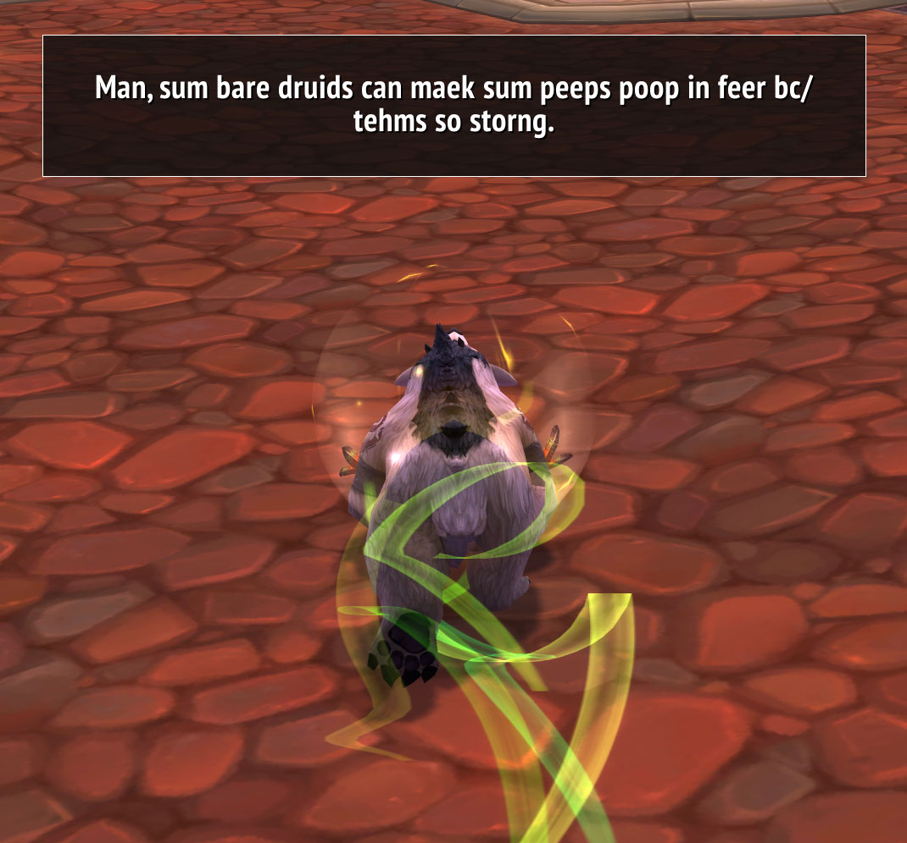
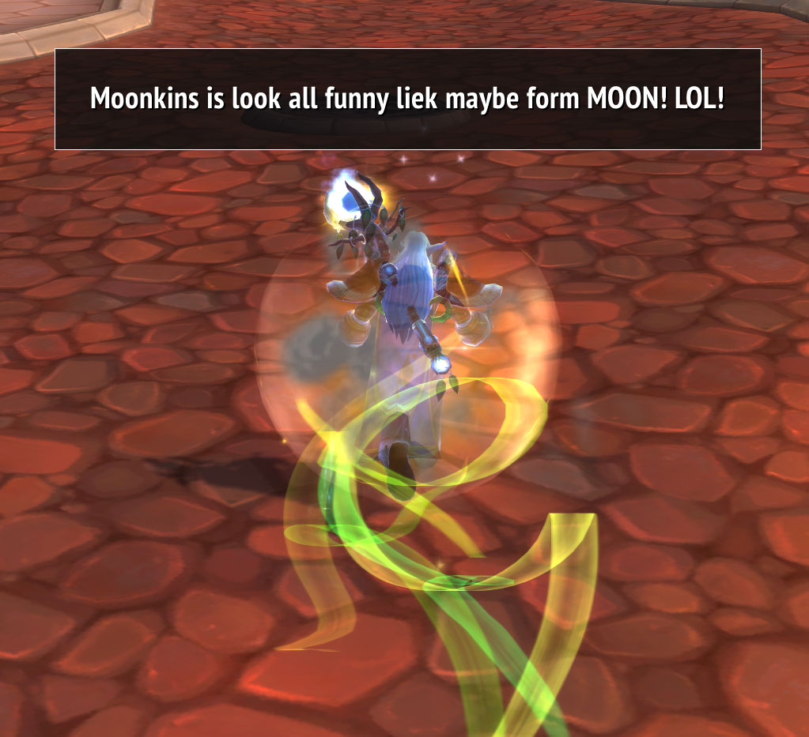

Long ago, there was a WoW add-on based on a forum post by a druid named Alamo.
This is a complete rewrite of that add-on to work with the modern WoW client.
No code from the original add-on was used, but this author still acknowledges the work of this add-on's spiritual successor, as well as Alamo himself.

# Description
This add-on will occasionally impart some of [Alamo's ancient wisdom](https://wowwiki.fandom.com/wiki/Alamo) whenever you shapeshift while playing a druid.
It may react to deliberate shapeshifting actions on your part, automatic ones by the game (e.g. Travel Form transitioning from aquatic to flight), and shapeshifting triggered by abilities (specifically Incarnation: Tree of Life).
It includes a basic set of options to manage its behavior, which is accessible by typing "/alamo" in chat.

# Getting started
1. on this web page, click the green **Clone or download** button above and to the right
2. click **Download ZIP**
3. once the ZIP is downloaded, open it on your desktop
4. open the `AlamoReeburth-master` folder inside the ZIP file
5. open a new Windows File Explorer window (Windows key + E) and use it to open the WoW Retail installation directory (if you installed World of Warcraft in its default location, you can copy and paste this into the address bar for Windows File Explorer: `%PROGRAMFILES(X86)%\World of Warcraft\_retail_`)
6. open the `Interface` folder (if it doesn't exist, create it)
7. open the `AddOns` folder (if it doesn't exist, create it)
8. copy the `AlamoReeburth` folder from the ZIP file into the `AddOns` folder

# Screenshots

## Caster

## Bear

## Aquatic

## Cat

## Travel

## Moonkin

## Tree

## Flight
